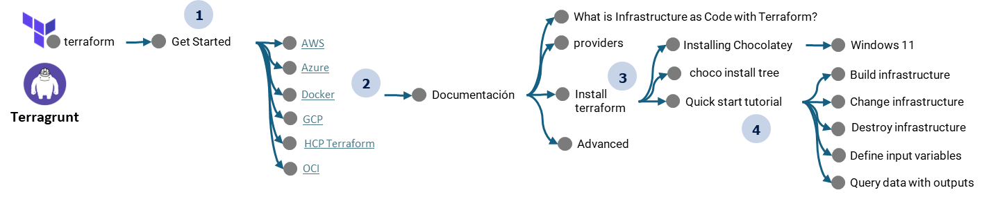

# Road Map


# Instalar terraform
| No | url terraform |
| ------ | ------ |
| 1 |[Documentación](https://developer.hashicorp.com/terraform/tutorials/docker-get-started)|
| 2 |[What is Infrastructure as Code with Terraform?](https://developer.hashicorp.com/terraform/tutorials/docker-get-started/infrastructure-as-code)|
| 3 |[Install terraform](https://developer.hashicorp.com/terraform/tutorials/docker-get-started/install-cli)|
| 4 |[providers](https://registry.terraform.io/browse/providers)|
| 5 |[Installing Chocolatey](https://chocolatey.org/install)|
| 6 |choco install tree|
| 7 |[Quick start tutorial](https://developer.hashicorp.com/terraform/tutorials/docker-get-started/install-cli)|
| 8 |[providers](https://registry.terraform.io/browse/providers)|

# Estructura Proyecto

Para terraform su estructur basica archivos es la siguiente

cree los siguientes archivos en la carpeta del proyecto

```
touch main.tf
touch outputs.tf
touch README.md
touch terraform.tfvars
touch variables.tf
```

# Comandos de terraform

```
terraform validate
terraform init
terraform plan -var-file terraform.tfvars -out sophos
terraform apply "sophos"
terraform destroy

```
# Limpiar proyecto
```
rm -rf .terraform terraform.tfstate
```